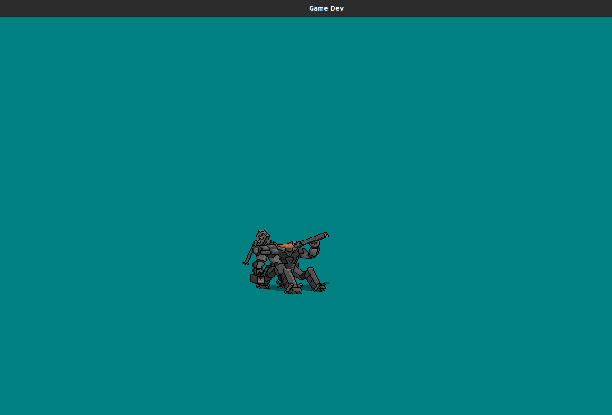

# cpp_capstone_project

basic OpenGL/SDL2 game engine 

This project is a submission for the Udacity C++ Nanodegree program capstone project

# Dependencies for Running Locally

 this project uses **conan package management** to manage dependencies  
     all libraries are manage by ***conan***`except for SDL2` 
     
   * python >= 3.4 for pip
      + install pip from here if need to [pip](https://pip.pypa.io/en/stable/installing/)
   * cmake >= 3.7
       - All OSes: click here for installation instructions
   *  make >= 4.1 (Linux, Mac), 3.81 (Windows)
       + Linux: make is installed by default on most Linux distros
       + Mac: [install Xcode command line tools to get make](https://developer.apple.com/xcode/features/)
       + Windows: [Click here for installation instructions](http://gnuwin32.sourceforge.net/packages/make.htm)
   * SDL2 >= 2.0
       + [All installation instructions can be found here](https://wiki.libsdl.org/Installation)
       + Note that for Linux, is preferred to building from source.
   * gcc/g++ >= 5.4
       + Linux: gcc / g++ is installed by default on most Linux distros
       + Mac: [install Xcode command line tools](https://developer.apple.com/xcode/features/)
       + Windows: recommend using [MinGW](http://www.mingw.org/)
   * conan
     + [you can download it here](https://conan.io/downloads.html)
# Basic Build Instructions
1. git clone  `https://github.com/ssamurai97/cpp_capstone_project.git`
2. `cd cpp_capstone_project/ `
3. make build directory `mkdir -p build`
4. change directory ` cd build `
5. run `cmake ..`
6. `make `
7. executable program will in `bin/game`
8. cd __bin/__ and run `./game` to run the program 

# Rubric points addressed
##### Loops, Functions, and I/O
   
   * The project reads data from a file and process the data, or the program writes data to a file.
     -  `src/shader.cpp` line `number 195-218`
   
   
   * The project demonstrates an understanding of C++ functions and control structures.
       - `src/game.cpp `
           * line `25-138`
   

##### Object Oriented Programming

* The project uses Object Oriented Programming techniques.
     - `include/actor.h`
*  Class constructors utilize member initialization lists.
  
     - `src/actor.cpp`
       * line `12-21`
* Classes use appropriate access specifiers for class members.

     - `include/shader.h`
        * line `19, 42, 58`
##### Memory Management

* The project uses destructors appropriately.
  - `include/component.cpp`
     * line `18-21`
* The project uses smart pointers instead of raw pointers.
  - `src/game.cpp`
     * line `line 33`
